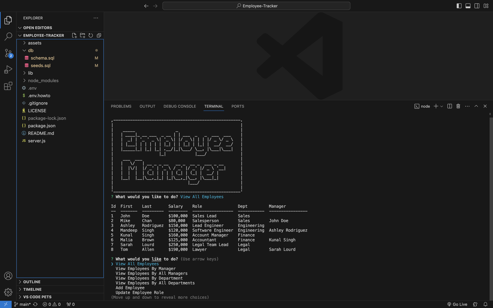

# Employee Tracker Application

This command-line application allows users to manage departments, roles, and employees within a company database.

## Table of Contents

- [Features](#features)
- [Technologies Used](#technologies-used)
- [License](#license)
- [Copyright](#copyright)

## Features

- View all departments
- View all roles
- View all employees
- Add a new department
- Add a new role
- Add a new employee
- Update an employee's role

## Technologies Used

- Node.js
- MySQL
- Inquirer.js
- Console.table

## Video Link
https://drive.google.com/file/d/1m-VEvS9RvwzYfda4KJnuzyBjKa-KrIIo/view

## License

This project is licensed under the MIT License. See the [LICENSE](LICENSE) file for details.

## Copyright

© 2024 Mandeep Singh. All Rights Reserved.
